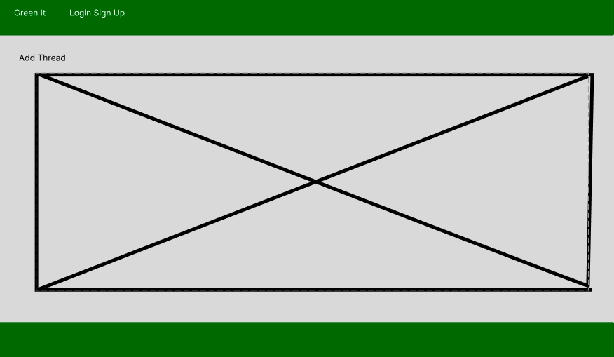
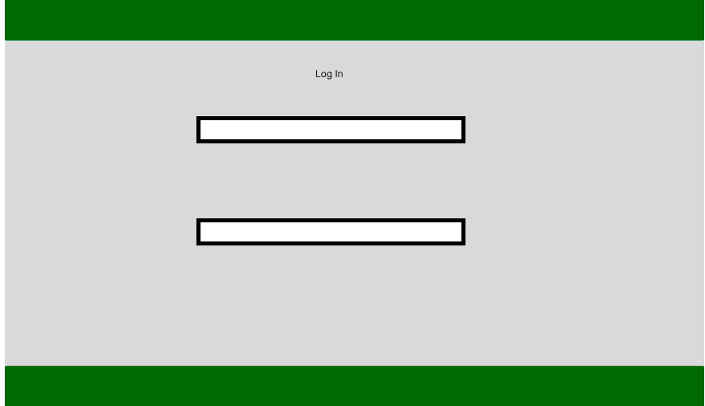
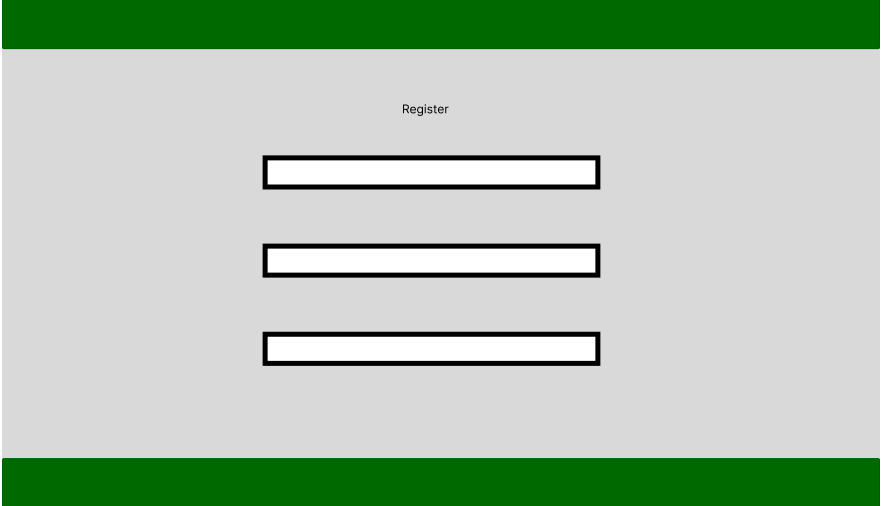

<h1 align="centre">GreenIt</h1>

[View live project here](https://tasniim5.github.io/ro-cham-beau/)

🌿 Welcome to Greenit: Your Sustainable Community Hub!

Hello, Greenit Community!

Are you seeking a space where you can engage in meaningful discussions, share insights, and connect with others who are passionate about sustainability? Look no further – Greenit is here to welcome you with open arms!

Greenit is your go-to forum for all things related to living a greener, more sustainable lifestyle. Whether you're interested in renewable energy, eco-friendly practices, or reducing your carbon footprint, you'll find a wealth of information and support within our community.

Join our diverse group of members and participate in discussions on topics ranging from sustainable living tips to environmental activism. Share your experiences, ask questions, and learn from others who share your dedication to making a positive impact on the planet.

But Greenit is more than just a forum – it's a vibrant community where connections are made, ideas are exchanged, and positive change is fostered. Engage with fellow members, collaborate on eco-friendly projects, and together, let's work towards a more sustainable future.

Ready to join the conversation and contribute to a greener world? Create an account, log in, and start engaging with the Greenit community today! Together, we can make a difference. 🌱💬

## Responsive Mockup

## Index 
* [Features](#features)
* [Wireframes](#wireframes)
* [User Stories](#user-stories)
* [Testing](#testing)
* [Deployment](#deployment)
* [Credits](#credits)

## Features

### Navigation Bar

Presented prominently on every page, the fully responsive navigation bar comprises links to the GreenIt Home page, Forum, Log in, Sign Up, ensuring consistency across all pages for seamless navigation. This element facilitates smooth transition between pages on all devices, eliminating the need to return to the previous page using the 'logo' button as a return to the main feed.

### Forum

A forum where users are able to create threads, log in and register as users. Keep up with all throughts regarding sustainability and green living. Post threads on the forum and reply to others creating a green sustainable community.

### Sign up

Allows site visitors to sign up sercurely to start posting on the feed.

### Log In

Allowers users to log in and post once onto the feed once they have registered as a user.

### New Thread

Allows users to create a new thread once they sign up and log in. 

### Features Left to Implement

-Django authersation and authentication
-Make the feed live to include users posts onto the home page. 

## Wireframes
### Index Page

### Log In 

### Register 

## Technologies Used
- __Programming Languages__
    - HTML5
    - CSS3
    - JavaScript
    -Python
      
- __Libraries & Programs Used__
    - [Github](https://github.com/) - Used for making and storing the repository for our project.
    - [Gitpod](https://www.gitpod.io/) - Used for writing and collaborating on code for the project.
    - [Github Projects] Used projects for the Kanban board to track project progress and monitor project tasks. 
    - [Figma](https://www.figma.com) Used to create Wireframes.
    

## User Stories

As a user who is environmentally-conscious, I aim to create an account on Greenit to connect with a community focused on sustainability. I intend to share my ideas, learn from others, and contribute to the global effort of preserving our planet for future generations.

As a user passionate about sustainable living, I prioritize logging in to Greenit regularly. I seek to stay updated on the latest news, discussions, and initiatives related to environmental conservation. Through active engagement, I aim to participate in meaningful conversations and stay informed about ways to make a positive impact.

As a user and member of Greenit, I value the opportunity to comment and reply on threads discussing various sustainability topics. Whether it's renewable energy, zero waste lifestyle, or eco-friendly products, I endeavor to share my insights, ask questions, and engage in constructive dialogues with like-minded individuals dedicated to protecting the planet.

As a user deeply concerned about the environment, I endeavor to leverage Greenit's platform to post threads. Through sharing important news articles, scientific research findings, or personal stories related to sustainability, I aim to raise awareness about pressing environmental issues and inspire others to take action towards creating a more sustainable future.

As a user keen on staying informed about global environmental developments, I utilize Greenit's news section. I access curated updates on climate change, biodiversity conservation efforts, sustainable development goals progress, and other relevant topics. This helps me stay educated and motivated to actively contribute to positive environmental change in my community and beyond.

## Testing

### Validator Testing

### -HTML

### -CSS

### -JavaScript

### - Python

## Deployment

## Credits

### Content

### Media 

